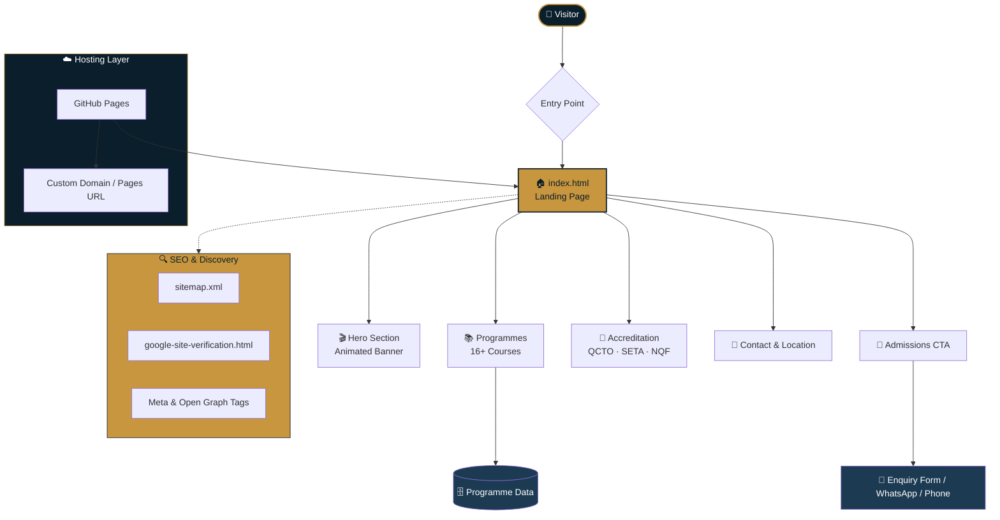
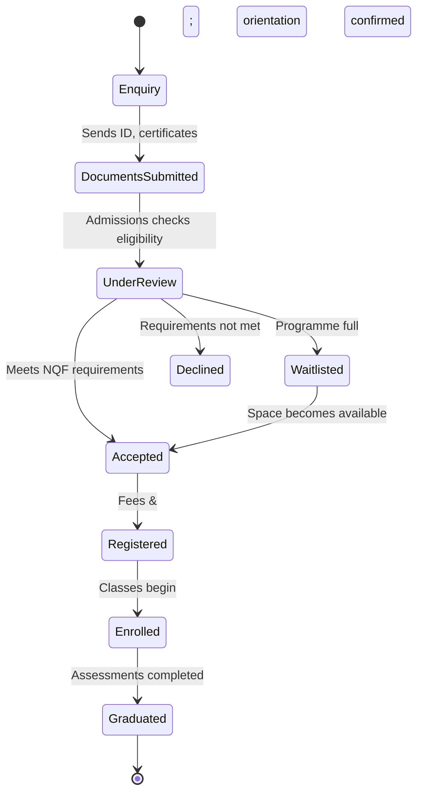
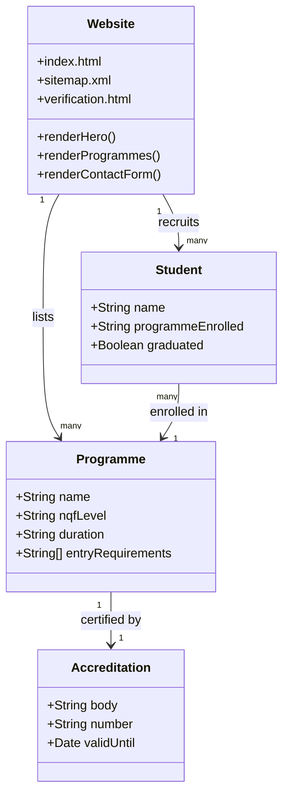
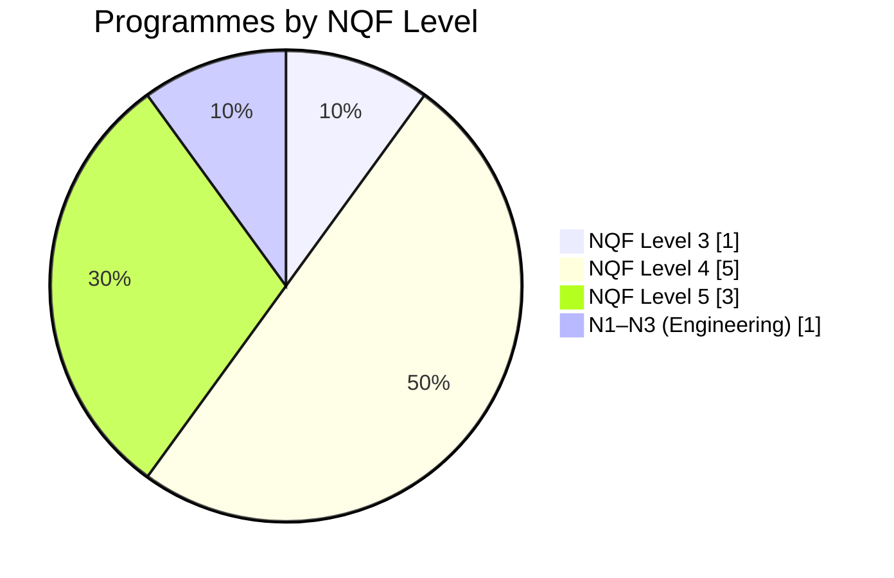
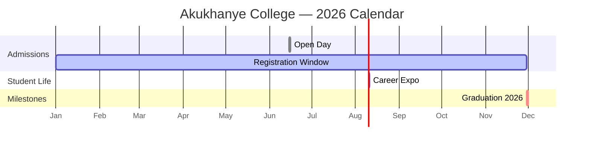

<div align="center">


<br/>

[](https://AkukhanyeSDP.github.io/akukhanye-college/)
[](https://www.qcto.org.za/)
[](https://www.seta.org.za/)
[](https://www.nqf.org.za/)
[](https://pages.github.com/)


<br/>

### 🛠️ Built With


</div>

<p align="center">
  <a href="#-about-the-project">About</a> •
  <a href="#️-gallery">Gallery</a> •
  <a href="#️-site-architecture">Architecture</a> •
  <a href="#-programmes--enrolment-mix">Programmes</a> •
  <a href="#-roadmap">Roadmap</a> •
  <a href="#-faq">FAQ</a> •
  <a href="#-contact-information">Contact</a>
</p>


## 📖 About The Project

**Akukhanye Private College** is a QCTO and SETA accredited private college based in Bizana, Eastern Cape, South Africa. Our name, **"Akukhanya"** – meaning *"light"* in isiXhosa and isiZulu – reflects our mission to bring quality education to communities that have been overlooked by traditional institutions.

Since our founding in 2010, we have grown from a small training centre into a fully accredited college offering **16+ programmes** across NQF Levels 4 and 5, with a rapidly expanding footprint across the Eastern Cape.

<table align="center">
<tr>
<td width="50%" valign="top">

### 🎯 Our Mission
To provide accessible, high-quality education and skills training that prepares students for meaningful employment and entrepreneurship, while contributing to the social and economic development of the Eastern Cape and South Africa.

</td>
<td width="50%" valign="top">

### 🔭 Our Vision
To be a leading private college in Pondoland and beyond, known for producing work-ready, competent graduates who drive change in their communities and industries.

</td>
</tr>
</table>

---

## 🖼️ Gallery

<div align="center">
<table>
<tr>
<td align="center" colspan="2"><br/><sub><b>Campus &amp; college life</b></sub></td>
</tr>
<tr>
<td align="center"><br/><sub><b>Accreditation milestone</b></sub></td>
<td align="center"><br/><sub><b>Student achievement</b></sub></td>
</tr>
</table>
</div>

> 💡 Swap the `<sub>` captions above with whatever each photo actually shows (e.g. "Open Day 2026", "QCTO Certificate Handover", "Graduation Ceremony").


## 🏗️ Site Architecture



## 🎓 Student Journey

```mermaid
sequenceDiagram
    autonumber
    participant P as 🧑 Prospective Student
    participant W as 🌐 Website
    participant A as 🧑‍💼 Admissions Team
    participant C as 🏫 College
    participant I as 🤝 Industry Partner

    P->>W: Browses programmes &amp; accreditation info
    W-->>P: Displays NQF level, duration, requirements
    P->>W: Submits enquiry / applies
    W->>A: Forwards application
    A->>P: Confirms registration &amp; orientation date
    A->>C: Enrols student in programme
    C->>P: Delivers coursework &amp; assessments
    C->>I: Coordinates workplace placement
    I-->>P: Work experience / internship
    C->>P: Graduation &amp; certification
    P->>I: Employment / entrepreneurship
    Note over P,I: 85% graduate employment rate 🎉
```

## 🔄 Application Status Flow



## 🧩 System Components



## 📊 Programmes & Enrolment Mix




## 🏆 Key Features

### Accreditation & Recognition
- ✅ **QCTO Accredited** – Quality Council for Trades and Occupations
- ✅ **SETA Registered** – Sector Education and Training Authorities
- ✅ **DHET Approved** – Department of Higher Education and Training
- ✅ **NQF Levelled** – National Qualifications Framework
- ✅ **POPIA Compliant** – Protection of Personal Information Act

<details>
<summary><b>📚 Click to see all programmes offered</b></summary>
<br/>

| Programme | NQF Level |
|---|---|
| 📊 Business Management | Level 5 |
| 💻 ICT Technical Support | Level 4 |
| 💰 Financial Management | Level 5 |
| 👶 Early Childhood Development | Level 4 |
| 🚀 New Venture Creation | Level 4 |
| ⚙️ Engineering Studies | N1–N3 |
| ☁️ Cloud Administrator | Level 5 |
| 📋 Office Clerk | Level 3 |
| 🩹 First Aid Responder | Level 2–4 |

</details>

### Our Impact

<div align="center">

| 🎓 Graduates | 📚 Courses | 📈 Pass Rate | 🏅 Years | 💼 Employment |
|:---:|:---:|:---:|:---:|:---:|
| **5,200+** | **24+** | **96%** | **15+** | **85%** |

**Graduate Pass Rate**
`████████████████████░` 96%

**Graduate Employment Rate**
`█████████████████░░░` 85%

</div>


## 🗺️ Roadmap



## 🚀 Live Website

🔗 **[https://AkukhanyeSDP.github.io/akukhanye-college/](https://AkukhanyeSDP.github.io/akukhanye-college/)**

## 📁 Repository Structure

```
akukhanye-college/
├── index.html                       # Main website
├── google00c8d8d9c0fee6a2.html      # Google Search Console verification
├── sitemap.xml                      # Sitemap for Google indexing
├── README.md                        # This file
└── .vscode/                         # VS Code settings (optional)
```

## 🛠️ Technologies Used

<div align="center">


</div>

- **HTML5** – Semantic markup
- **CSS3** – Custom styling with responsive design
- **Font Awesome 6** – Icon library
- **GitHub Pages** – Hosting and deployment
- **Google Search Console** – SEO and indexing

## 📊 SEO & Google Search Console

- ✅ Meta tags for description and keywords
- ✅ Open Graph tags for social media sharing
- ✅ Google Search Console verification
- ✅ XML sitemap for better indexing
- ✅ Mobile-responsive design

**Google Search Console Property:** `https://AkukhanyeSDP.github.io/akukhanye-college/`

## 🎨 Design Features

- **Responsive Design** – Works on all devices (desktop, tablet, mobile)
- **Color Scheme** – Professional dark blue (`#0a1e2b`) with gold accents (`#c8963e`)
- **Modern Layout** – Clean card-based design with smooth animations
- **Accessibility** – High contrast and readable fonts
- **Proudly South African** – Cultural identity and heritage highlighted

## 📝 Core Values

| Value | Description |
|-------|-------------|
| ⭐ **Excellence** | We strive for the highest standards in teaching and learning |
| 🤝 **Integrity** | We act honestly, ethically, and transparently |
| 👥 **Community** | We uplift the communities we serve |
| 💡 **Innovation** | We embrace modern methods and technology |
| 🚀 **Empowerment** | We equip students with skills for life |


## ❓ FAQ

<details>
<summary><b>Is Akukhanye Private College accredited?</b></summary>
<br/>Yes — the college is QCTO and SETA accredited, DHET approved, and NQF levelled. Full accreditation details are in the table below.
</details>

<details>
<summary><b>Where is the college located?</b></summary>
<br/>TotalEnergies Bizana, 21st Avenue, Thompson Ave, R61, Mbizana, 4800, Eastern Cape, South Africa.
</details>

<details>
<summary><b>How do I apply?</b></summary>
<br/>Reach out via phone, email, or the enquiry form on the website. The admissions team will confirm eligibility and guide you through registration — see the Student Journey diagram above.
</details>

<details>
<summary><b>When is the next Open Day?</b></summary>
<br/>15 June 2026 — see the Roadmap section above for all key 2026 dates.
</details>

## 📞 Contact Information

| Detail | Information |
|--------|-------------|
| **📍 Address** | TotalEnergies Bizana, 21st Avenue, Thompson Ave, R61, Mbizana, 4800, Eastern Cape |
| **📞 Phone** | +27 39 251 0118 |
| **📧 Email** | info@Akukhanye.co.za |
| **🕐 Hours** | Monday–Friday, 8am–5pm |

## 🔗 Quick Links

| Link | URL |
|------|-----|
| **🌐 Live Website** | https://AkukhanyeSDP.github.io/akukhanye-college/ |
| **📁 GitHub Repository** | https://github.com/AkukhanyeSDP/akukhanye-college |
| **📊 Google Search Console** | https://search.google.com/search-console |
| **🔍 Verification File** | https://AkukhanyeSDP.github.io/akukhanye-college/google00c8d8d9c0fee6a2.html |
| **🗺️ Sitemap** | https://AkukhanyeSDP.github.io/akukhanye-college/sitemap.xml |

## 🚀 How to Contribute

1. Fork the repository
2. Create your feature branch: `git checkout -b feature/AmazingFeature`
3. Commit your changes: `git commit -m 'Add some amazing feature'`
4. Push to the branch: `git push origin feature/AmazingFeature`
5. Open a Pull Request

## 📄 License

This project is for **Akukhanye Private College** and all rights are reserved.

## 🇿🇦 Proudly South African

> *"We believe every student deserves access to an education that opens doors – not just in theory, but in the real economy."*

**Akukhanye Private College** – Shaping careers, building futures since 2010.

## 👨‍💻 Development Team

| Role | Person |
|------|--------|
| **College Principal** | Academic Leadership |
| **Head of Programmes** | Curriculum & Quality |
| **Student Affairs** | Welfare & Support |
| **Industry Liaison** | Placements & Partnerships |

## 🏅 Accreditation Details

| Detail | Information |
|--------|-------------|
| **Accreditation Number** | 02-QCTO/SDP210525173053 |
| **Organisation ID** | 2023/739869/07 |
| **Unique ID** | SDP210525173053 |
| **Valid Until** | 15 May 2030 (5 years) |

## 📅 Important Dates

| Event | Date |
|-------|------|
| **Open Day** | 15 June 2026 |
| **Career Expo** | 10 August 2026 |
| **Graduation 2026** | 30 November 2026 |
| **Registration Deadline** | 30 November 2026 |

## 📚 Additional Resources

- [QCTO Official Website](https://www.qcto.org.za/)
- [SETA Official Website](https://www.seta.org.za/)
- [NQF Framework](https://www.nqf.org.za/)
- [DHET South Africa](https://www.dhet.gov.za/)


<div align="center">

## ⭐ Show Your Support

If you found this project helpful, please give it a ⭐ on GitHub!


**Made with ❤️ in Bizana, Eastern Cape, South Africa**
**© 2026 Akukhanye Private College**


[⬆ Back to Top](#-akukhanye-private-college)

</div>
